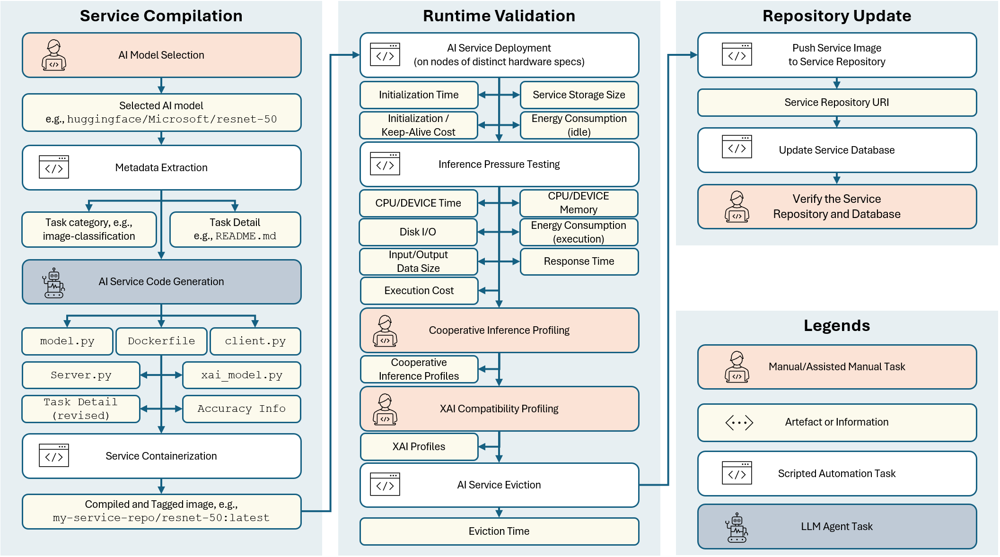

# Edge AI Service Wrapper

Welcome to the **Edge AI Service Wrapper** repository! This project provides a comprehensive set of tools to streamline the process of building your first AI service repositories ready for deployment at 6G AI-RAN computation nodes (edge, cloud).

Contact: Yun.Tang [at] cranfield [dot] ac [dot] uk

## Toolchain Overview



## Project Structure

### AI Service Docker Images
- Each Docker image includes a REST API server to serve the AI model.
- Additional endpoints are provided for profiling the runtime statistics (e.g., resource usage) and explainability information.
- All AI service source codes are stored under the `models/` folder.

### Service Repo Manager
- A FastAPI-based server for managing AI services.
- Includes CRUD endpoints for individual AI services.
- For more details, check out the [Service Repo Manager README](service_repo_manager/README.md).

### Tools
Located under the `tools/` folder, these utilities simplify the process of preparing Docker images for AI services.


## Getting Started to Build AI services from Huggingface Pre-trained Models

1. Clone the repository:
   ```bash
   git clone https://github.com/Cranfield-GDP/edge-ai-service-wrapper.git
   cd edge-ai-service-wrapper

2. Install dependencies:
    ```bash
    pip install dotenv openai requests rich setuptools
    ```
3. To wrap hugging face pre-trained models, run the main script:
    ```bash
    cd tools/huggingface_ai_model_wrapper
    python entrypoint.py 
    ```

4. Follow the steps in the script to prepare your AI service docker image and database.